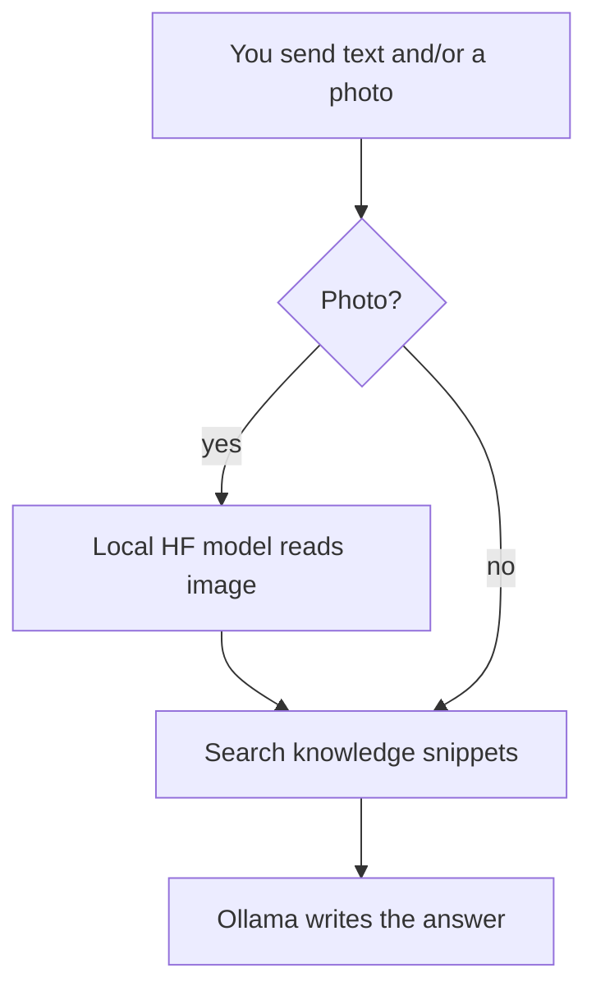

# Mini-RAG Telegram bot

Answers questions using a **small local folder of documents** (`knowledge/`). You can ask in **text** or send a **screenshot**; text is taken from the image with a **local Hugging Face** model (BLIP, LLaVA, etc.) or optional **Tesseract**.

**New here?** Read [HOW_IT_WORKS.md](HOW_IT_WORKS.md) first.

## What you can send

| What you do | What happens |
|-------------|----------------|
| `/ask How do I request PTO?` | Searches the knowledge files and answers. |
| Send a **photo** | A local image model reads text / meaning from the image, then search + answer. |
| Photo **with a caption** | Your caption + image output are combined, then search. |

Commands: `/start`, `/help`, `/ask`.

## Image → text (local Hugging Face)

Set in `.env`:

| `IMAGE_TEXT_BACKEND` | What it uses | Notes |
|----------------------|----------------|-------|
| `blip_vqa` (default) | `Salesforce/blip-vqa-base` | Asks the model to transcribe visible text; runs on CPU (slower) or GPU. |
| `blip_caption` | `Salesforce/blip-image-captioning-base` | Short image description; not strict OCR. |
| `llava` | `llava-hf/llava-1.5-7b-hf` (override with `IMAGE_TEXT_MODEL`) | Strong; prefer **GPU** and enough RAM. |
| `clip_interrogator` | [clip-interrogator](https://github.com/pharmapsychotic/clip-interrogator) | `pip install clip-interrogator` — rich caption, not literal OCR. |
| `tesseract` | System Tesseract + optional `pytesseract` | Classic OCR; install OS package + `pip install pytesseract`. |

Also set `HF_IMAGE_DEVICE=auto|cpu|cuda|mps` and optionally `IMAGE_TEXT_MODEL` to another compatible HF model id.

## Other stack pieces

| Part | Role |
|------|------|
| **sentence-transformers** | Search embeddings for the knowledge files. |
| **sqlite-vec** | Vector search over chunks. |
| **Ollama** | Final chat answer (`OLLAMA_CHAT_MODEL`). |
| **python-telegram-bot** | Telegram API. |

## Simple flow

## Run locally

1. Install **Ollama** and `ollama pull <your model>`.
2. Create a virtual environment and install deps (pick **one** path):
   - **Normal:** `cd mini_rag_telegram_bot && python3 -m venv .venv && source .venv/bin/activate` then `pip install -r requirements.txt`.  
     If you see *ensurepip is not available*, install `python3.11-venv` (Debian/Ubuntu) or use **uv** below.
   - **DSW / broken `venv` / PEP 668:** use [uv](https://github.com/astral-sh/uv):  
     `cd mini_rag_telegram_bot && rm -rf .venv && uv venv .venv && source .venv/bin/activate && uv pip install -r requirements.txt`  
   - **Uber DSW kernel:** activate the kernel venv shown in your notebook terminal message, then `pip install -r requirements.txt` from `mini_rag_telegram_bot/`.
3. `cp .env.example .env` — set `TELEGRAM_BOT_TOKEN` and optionally `IMAGE_TEXT_BACKEND` / `llava`.
4. `python3 -m rag.app`  
   Or: `python3 -m rag.Tel_bot` (same as `python3 -m rag.app`; shim is `rag/Tel_bot.py`).

macOS SQLite extension issues: [sqlite-vec Python notes](https://alexgarcia.xyz/sqlite-vec/python.html).

## Docker Compose

`docker compose up --build` then `docker compose exec ollama ollama pull llama3.2`.  
Image models run **inside the bot container** (CPU by default); LLaVA will be **slow or OOM** without GPU — use `blip_vqa` in Docker unless you add GPU support.

## Layout

- `rag/app.py` — Telegram handlers; `rag/config.py` — settings.
- `rag/image_text.py` — BLIP / LLaVA / CLIP Interrogator / Tesseract.
- `rag/pipeline.py` — gather text → search → Ollama.
- `knowledge/` — your documents.

## Hugging Face instead of Ollama for the final answer

Replace `_call_ollama_chat` in `rag/pipeline.py` with a `transformers` text generator; keep search + prompts the same.
