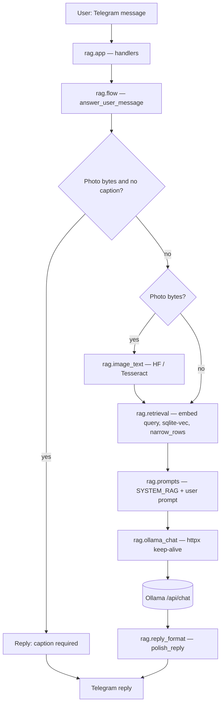
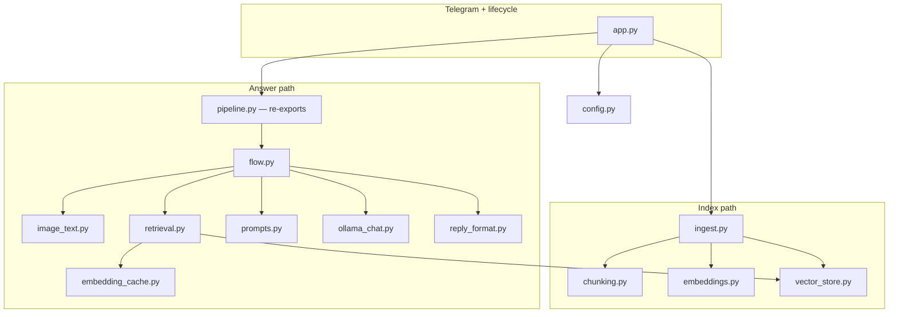

# Mini-RAG Telegram bot

Answers questions using a **local folder of Markdown** (`knowledge/`). You can ask in **text** (`/ask`) or send a **photo**; photos **must include a one-line caption** in Telegram. Image understanding uses a **local Hugging Face** model (BLIP-2, LLaVA, etc.) or optional **Tesseract**. The final answer is generated by **Ollama** over HTTP.

**Plain-language overview:** [HOW_IT_WORKS.md](HOW_IT_WORKS.md) (may lag small `.env` defaults; this README and `rag/config.py` are authoritative).

## What you can send

| What you do | What happens |
|-------------|----------------|
| `/ask How do I request PTO?` | Embeds the question, searches `knowledge/`, calls Ollama with retrieved context. |
| Send a **photo without a caption** | Bot asks you to add a caption (required). |
| Send a **photo with a caption** | Vision model reads the image; caption + image text are merged for search, then Ollama answers. |

Commands: `/start`, `/help`, `/ask <question>`.

---

## How to run the code locally

1. **Install [Ollama](https://ollama.com)** and pull a chat model, e.g. `ollama pull mistral` or `ollama pull llama3.2` (must match `OLLAMA_CHAT_MODEL` in `.env`).
2. **Create a virtual environment** and install dependencies (from the `mini_rag_telegram_bot/` directory):

   - **Normal:**  
     `python3 -m venv .venv && source .venv/bin/activate` (Windows: `.venv\Scripts\activate`)  
     `pip install -r requirements.txt`  
     If *ensurepip is not available*, install `python3.11-venv` (Debian/Ubuntu) or use **uv** below.

   - **Broken `venv` / PEP 668:** use [uv](https://github.com/astral-sh/uv):  
     `rm -rf .venv && uv venv .venv && source .venv/bin/activate && uv pip install -r requirements.txt`

   - **Managed notebook / DSW kernel:** activate the project venv, then `pip install -r requirements.txt` from `mini_rag_telegram_bot/`.

3. **Configure environment:**  
   `cp .env.example .env`  
   Set at least `TELEGRAM_BOT_TOKEN` (from [@BotFather](https://t.me/BotFather)). Adjust `OLLAMA_BASE_URL` if Ollama is not on `http://127.0.0.1:11434`.

4. **Start the bot** (must run from `mini_rag_telegram_bot/` so imports resolve):

   ```bash
   python3 -m rag.app
   ```

   Equivalent shim:

   ```bash
   python3 -m rag.Tel_bot
   ```

5. **First run:** may download Hugging Face weights (embedding + image model) and build `data/rag.db` from `knowledge/` if needed.

**macOS / SQLite:** if the stdlib `sqlite3` cannot load extensions, see [sqlite-vec Python notes](https://alexgarcia.xyz/sqlite-vec/python.html) — this project uses `pysqlite-binary` to help.

**Docker:** `docker compose up --build`, then e.g. `docker compose exec ollama ollama pull mistral`. Heavy vision models (e.g. LLaVA) are slow or OOM on CPU-only containers; prefer `IMAGE_TEXT_BACKEND=blip2` or lighter backends unless you add GPU.

---

## Models and APIs used

| Layer | Technology | Role |
|--------|------------|------|
| **Messaging** | [Telegram Bot API](https://core.telegram.org/bots/api) via **python-telegram-bot** | Long polling, commands, photos, replies. |
| **Chat / generation** | **Ollama** HTTP API `POST /api/chat` (local) via **httpx** (`rag/ollama_chat.py`) | System + user prompt; model name from `OLLAMA_CHAT_MODEL`. Optional: `OLLAMA_NUM_PREDICT`, `OLLAMA_NUM_CTX`, `OLLAMA_TEMPERATURE`, timeouts. |
| **Embeddings (search + ingest)** | **sentence-transformers** (default `sentence-transformers/all-MiniLM-L6-v2`, 384-dim) | `rag/embeddings.py` batches text at ingest; `rag/retrieval.py` embeds the user query (with optional cache). |
| **Query embedding cache** | In-process TTL + LRU (`rag/embedding_cache.py`) | Reuses identical query vectors within `EMBEDDING_QUERY_CACHE_TTL_SEC` (disable with `0`). |
| **Vector index** | **SQLite** + **sqlite-vec** (`rag/vector_store.py`) | Chunk storage and k-NN search; path `SQLITE_PATH` (default `data/rag.db`). |
| **Image → text** | **transformers** + **torch** + **Pillow** (`rag/image_text.py`) | Local HF pipelines; default backend `blip2` → `Salesforce/blip2-opt-2.7b` unless overridden. |
| **Config** | **python-dotenv** | Loads `.env` from project root. |

No cloud LLM API is required for the default stack: Ollama and models run locally (after initial HF downloads if applicable).

### Image backends (`IMAGE_TEXT_BACKEND`)

| Value | Typical model | Notes |
|-------|----------------|-------|
| `blip2` (recommended default in `.env.example`) | `Salesforce/blip2-opt-2.7b` | Strong for screenshots / UI-style text. |
| `llava` | `llava-hf/llava-1.5-7b-hf` (override with `IMAGE_TEXT_MODEL`) | Heavier; GPU recommended. |
| `blip_vqa` | `Salesforce/blip-vqa-base` | Lighter; often weak on arbitrary screenshots. |
| `blip_caption` | `Salesforce/blip-image-captioning-base` | Scene caption, not strict OCR. |
| `clip_interrogator` | CLIP Interrogator | `pip install clip-interrogator` — tags, not literal OCR. |
| `tesseract` | System Tesseract | `pip install pytesseract` + OS package; optional `TESSERACT_CMD` on Windows. |

Set `HF_IMAGE_DEVICE` to `auto`, `cpu`, `cuda`, or `mps` as needed.

---

## System design

### Runtime flow (one user question)



`rag.retrieval` uses **`rag.embedding_cache`** (TTL/LRU) for the query vector, then **`rag.vector_store`** (sqlite-vec) and distance filters. For **text-only** `/ask`, the vision branch is skipped.

### Package layout (modules)



- **`pipeline.py`** — thin compatibility layer: imports `answer_user_message` and `close_ollama_http_client` from **`flow.py`** (same public API as before).
- **`app.py`** — on shutdown, closes the shared Ollama **httpx** client.

### Startup (ingest)

On launch, **`ingest_if_needed()`** refreshes chunks in SQLite when `knowledge/` files change (`AUTO_REINGEST`). That path uses **batch** `encode_texts` in **`embeddings.py`** (not the query cache).

---

## Project layout

| Path | Purpose |
|------|---------|
| `rag/app.py` | Telegram entrypoint, warmup, polling. |
| `rag/pipeline.py` | Re-exports `flow` entrypoints. |
| `rag/flow.py` | Orchestration: vision → retrieval → prompt → Ollama → polish. |
| `rag/retrieval.py` | Search query text, vector search, distance filtering. |
| `rag/ollama_chat.py` | Shared async HTTP client to Ollama. |
| `rag/embedding_cache.py` | Query embedding cache. |
| `rag/reply_format.py` | Post-process LLM text for Telegram. |
| `rag/embeddings.py`, `rag/vector_store.py`, `rag/ingest.py`, `rag/chunking.py` | Indexing and storage. |
| `rag/prompts.py`, `rag/user_messages.py` | Prompts and user-facing strings. |
| `rag/config.py` | All environment-driven settings. |
| `knowledge/` | Your Markdown documents. |
| `data/` | Default location for `rag.db` (gitignore local DB files in your repo). |

---

## Swapping Ollama for a Hugging Face text generator

Keep **`rag/retrieval.py`**, **`rag/prompts.py`**, and **`rag/flow.py`** (or replace the Ollama call inside **`rag/ollama_chat.py`** with a local `transformers` generate loop) so the RAG prompt shape stays the same.
